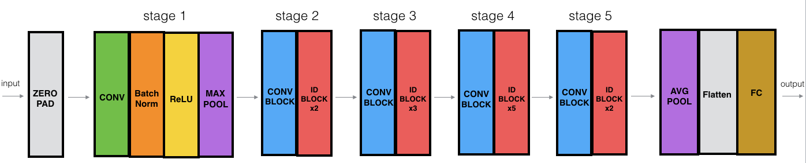
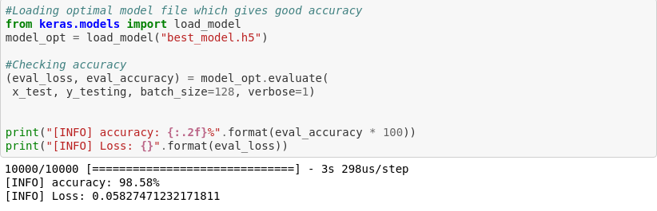

# Handwritten-Digit-Recognition-by-building-ResNet50-From-Scratch-

This work is towards demonstrating ResNet50 architecture and it working on MNIST handwritten digits dataset.

I have implemented ResNet50 Architecture from scratch using Keras library.

## Accuracy:-

I Have achieved Test accuracy of 98.5%

